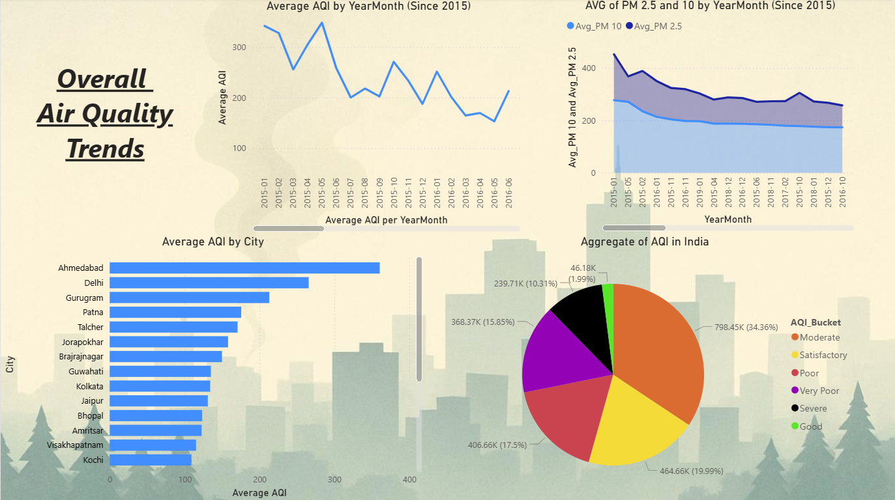
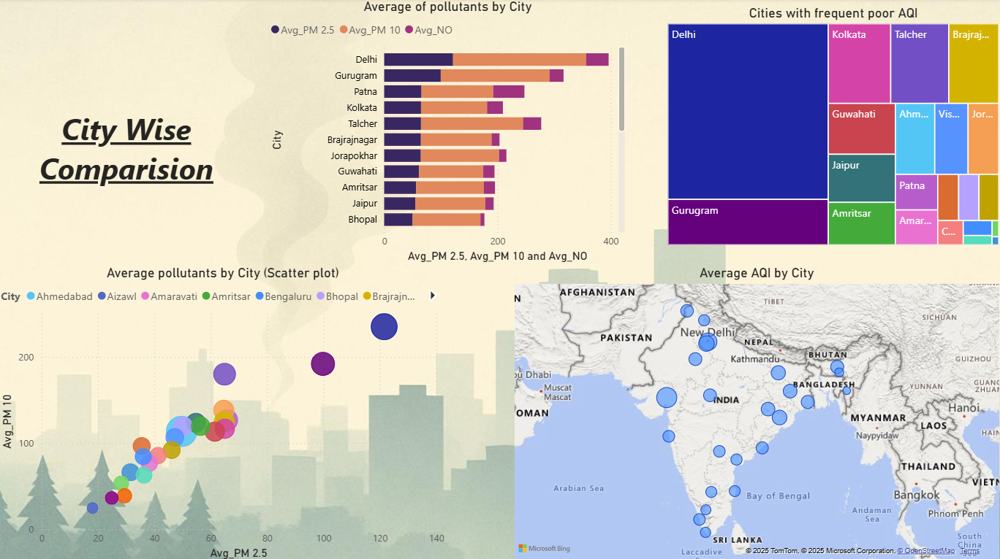
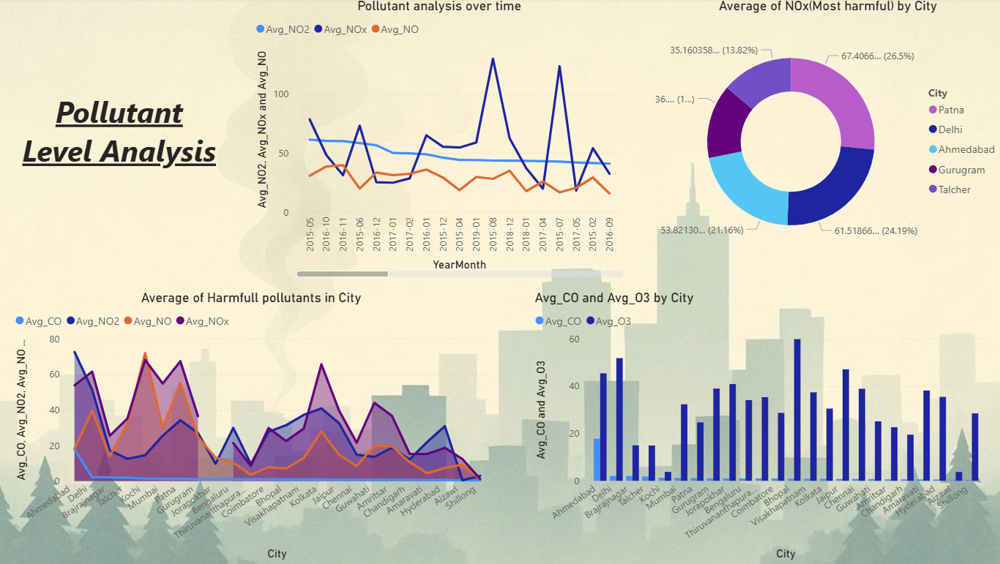
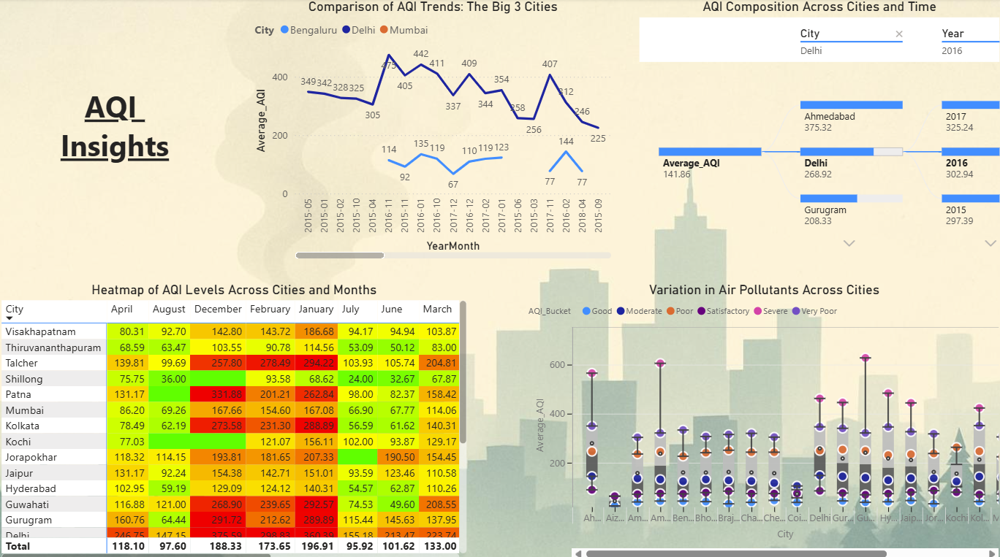

# AQI Analysis of Indian Cities (Power BI)

Visual analytics of air quality across 25+ Indian cities (2015–2017) using Microsoft Power BI. Interactive dashboards reveal pollutant trends, city-wise risk, and seasonal patterns.

---

## 🚀 Overview
This project transforms raw environmental data into actionable insights with Power BI:
- **City-wise pollution burden** (Delhi, Ahmedabad, Gurugram, Patna, Talcher, etc.)
- **Temporal patterns** (winter spikes, monsoon dips)
- **Pollutant relationships** (PM2.5 vs PM10 correlation; NOx hotspots)
- **AQI bucket distribution** by region and season

---

## ▶️ Quick Tour
- **Power BI Dashboard (.pbix)**: [`AQI Analysis India.pbix`](AQI%20Analysis%20India.pbix)
- **Data file (CSV)**: [`city_day.csv`](city_day.csv)
- **Report (PDF)**: [`docs/AQI Analysis India.pdf`](docs/AQI%20Analysis%20India.pdf)

---

## 📊 Dashboards & Highlights

### 1. Air Quality Trends
[View Dashboard](docs/screenshots/AirQualityTrends.png)
- National AQI patterns over time  
- Seasonal spikes and dips (winter highs, monsoon lows)  
- Overall AQI bucket distribution for 2015–2017  

### 2. City-wise Comparison
[View Dashboard](docs/screenshots/City-wiseComparison.png)
- Ranking of cities by average AQI  
- Regional differences in pollution levels  
- Identification of top hotspots (Delhi, Gurugram, Patna, Talcher)  

### 3. Pollutant Level Analysis
[View Dashboard](docs/screenshots/PollutantLevelAnalysis.png)
- PM2.5 vs PM10 correlation scatter plots  
- NO/NO2/NOx temporal trends and seasonal peaks  
- CO and O3 variations across selected cities  

### 4. AQI Insights
[View Dashboard](docs/screenshots/AQIInsights.png)
- AQI bucket segmentation (Good/Moderate/Poor/Very Poor)  
- Heatmaps showing city-specific monthly severity  
- Key takeaways highlighting pollutant contributions and health risks  

> **Key observations:** PM2.5 & PM10 dominate AQI; NOx peaks Oct–Feb; Delhi, Gurugram, Patna, Talcher are hotspots; coastal cities fare better.

---

## 📝 Data
- **File:** `city_day.csv`
- **Source:** Public AQI dataset (2015–2017) with pollutants: PM2.5, PM10, NO, NO2, NOx, CO, O3.
- **Columns:** Date, City, pollutant levels, AQI, AQI bucket.
- **Cleaning:** handled missing values, standardized pollutant columns, created DAX measures for averages and AQI bucket percentages.

---

## 🔍 Methodology (Power BI)
- Visual types: line/area charts, bar/column charts, treemaps, maps, scatterplots, donuts, heatmaps, decomposition trees.
- Interactivity: slicers for **City**, **Year/Month**, **Pollutant**.
- DAX measures: average pollutants, AQI bucket distribution %, YoY trend.

---

## 🪪 License
MIT — feel free to reuse with attribution.

---
